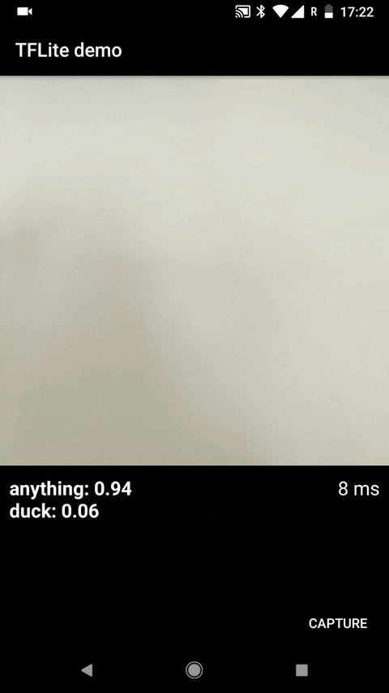

# Simple Android app example with Tensorlfow Lite use

Convolutional Neural Network are current state of the art for image classification. You can find here how to implement a frozen `.tflite` model to an Android app.

The Convolutional Neural Network recognizes a dug toy. Application takes frames from camera and passes it to trained Tensorflow model.

## Application

## Note
- This repo is part of our blog post [eMan Tensorflow](https://www.eman.cz/blog/)
- If you're interested in training your own model and hot to freeze it for an Android app, check our repository [Simple Convolutional Neural Network with Tensorflow](https://gitlab.eman.cz/branislav.stupak/tensorflow-demo-py)
- Built with help of [Camera2 API example](https://github.com/tensorflow/tensorflow/tree/master/tensorflow/contrib/lite/examples) and [Tensorflow Lite example](https://github.com/tensorflow/tensorflow/tree/master/tensorflow/contrib/lite/examples)
- If you find this repository useful, please consider ★ starring it
